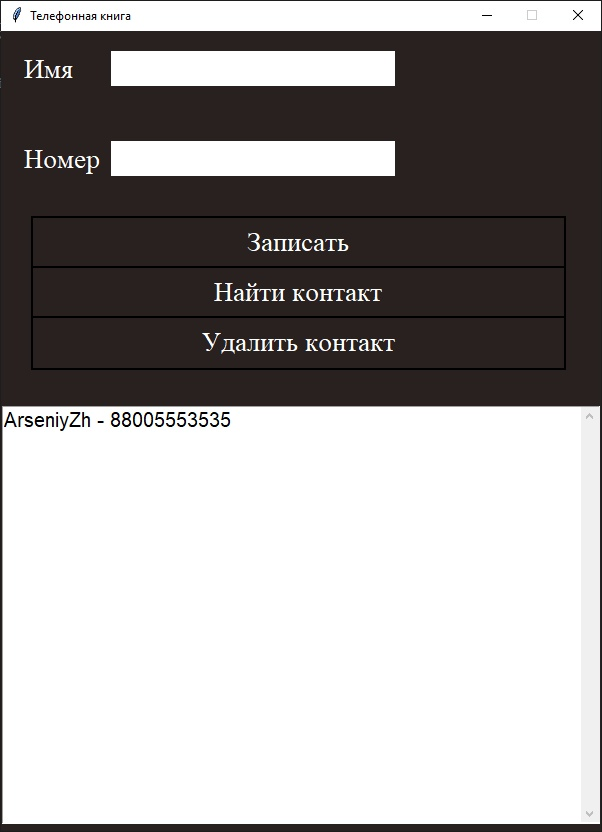

# phone_book
 

<b>RU</b> 
 Телефонная книга на tkinter. 
 Все данные хранятся в БД на Вашем компьютере. 
  
 
 Вы можете: 
 -Добавить контакт. 
 -Найти контакт. 
 -Удалить контакт. 
 
 

 
 <b>EN</b> 
 Phone book on tkinter. 
 All data is stored in a database on your computer. 
  
 
 You can: 
 -Add a contact. 
 -Find a contact. 
 -Delete the contact. 
  
